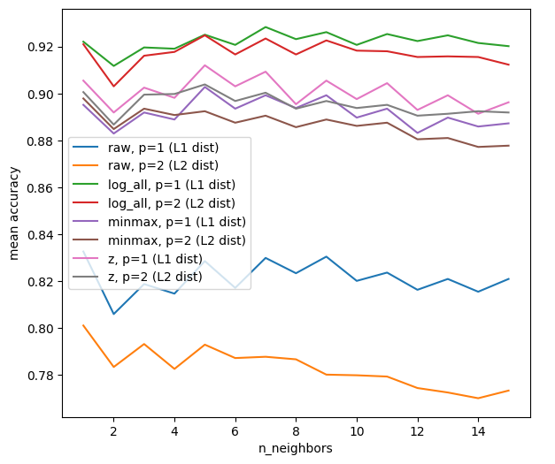
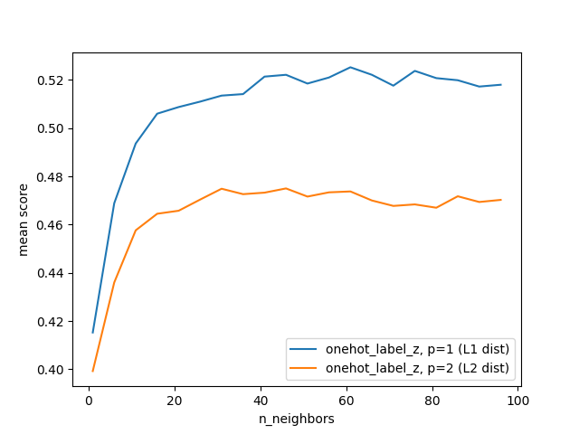

# Supervised Learning Exercise 2

  
  

<em>Left: kNN grid search results on Spambase. Right: kNN grid search results on Loan.</em>

## Project Overview
- Coursework project comparing classical classifiers across multiple tabular datasets (Spambase, Nursery, Loan, Breast Cancer).
- Focus on how preprocessing choices (encoding, scaling, transformations) and hyperparameters influence accuracy and F1.
- Evaluated decision trees, k-nearest neighbours, and logistic regression using consistent experimental pipelines.

## Datasets
- **Spambase** (UCI): 4,601 emails with 57 numeric features; target labels spam vs. ham.
- **Nursery** (UCI): 12,960 categorical records that require encoding; highly imbalanced target.
- **Loan & Breast Cancer**: Additional classification datasets.

## Methodology
1. Exploratory analysis to understand class balance, feature distributions, and preprocessing needs.
2. Applied dataset-specific preprocessing (log transforms, scaling, one-hot and label encoding) to support different models.
3. Trained decision trees, kNN, and logistic regression with systematic grid/parameter sweeps.
4. Compared holdout and cross-validation metrics (accuracy, F1) and tracked runtime considerations.

## Key Findings
- No single algorithm dominated; performance depended on dataset characteristics and preprocessing.
- For Spambase, kNN accuracy improved after log scaling and careful neighbour selection.
- Logistic regression benefited from appropriate regularisation (C, penalty type) and solver choice, especially on high-dimensional data.
- Class imbalance (e.g., Nursery) required label merging or weighting to avoid majority bias.

## Repository Layout
- `notebooks/`: Jupyter notebooks for EDA and model training.
- `data/`: Compressed source datasets.
- `docs/`: Project instructions and reports.
- `figs/`: Result figures.